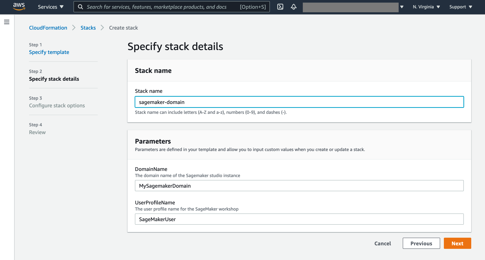

# Detect Personal Protective Equipment using Amazon Rekognition

This lab is provided as part of **[AWS Innovate Data And AI/ML Edition](https://aws.amazon.com/events/aws-innovate/apj/aiml-data/)**.

ℹ️ You will run this lab in your own AWS account. Please follow directions at the end of the lab to remove resources to avoid future costs.

## **Overview**
In the first part of this lab, you will learn how to detect if persons in the images are wearing the required PPE such as face covers, hand covers, and head covers. 

After that, you will deploy a web app that uses a webcam to extract frames and send them to an AWS API Gateway. The API Gateway then calls a AWS Lambda that interacts with Amazon Rekognition and calls the `DetectProtectiveEquipment` endpoint. When any protective equipment is detected the UI Interface shows the equipment name, its confidence level, and whether it covers the body part or not. Optionally, it is possible to configure an Amazon SNS Topic to allow subscribers to be notified of any detection.

This is a labified version of this [AWS Blog](https://aws.amazon.com/blogs/machine-learning/automatically-detecting-personal-protective-equipment-on-persons-in-images-using-amazon-rekognition/)

## **Index**
- [Prerequisites](#prerequisites)
- [Personal Protective Equipment (PPE) Detection](#personal-protective-equipment-ppe-detection)
- [Web App Deployment](#web-app-deploymentdeployment)
- [Accessing the application](#accessing-the-application)
- [Clean Up](#clean-up)

## **Prerequisites**

### **Create a SageMaker Studio domain**
To to the lab, you will require an AWS account. If you don’t already have an AWS account, create one at <https://aws.amazon.com> by following the on-screen instructions. Your access to the AWS account must have IAM permissions to launch AWS CloudFormation templates that create IAM roles.

Deploy the latest CloudFormation template by following the link below for your preferred AWS region:

| Region                                | Launch Template                                                                                                                                                                                                                                                                                     |
| ------------------------------------- | --------------------------------------------------------------------------------------------------------------------------------------------------------------------------------------------------------------------------------------------------------------------------------------------------- |
| **US East (N. Virginia)** (us-east-1) | [](https://console.aws.amazon.com/cloudformation/home?region=us-east-1#/stacks/new?stackName=rekognition-immersion-day-sagemaker-notebook&templateURL=https://aws-rek-immersionday-us-east-1.s3.amazonaws.com/deployment/rek-immersion-day-setup.yml) |
| **US West (Oregon)** (us-west-2)      | [](https://console.aws.amazon.com/cloudformation/home?region=us-west-2#/stacks/new?stackName=rekognition-immersion-day-sagemaker-notebook&templateURL=https://aws-rek-immersionday-us-west-2.s3-us-west-2.amazonaws.com/deployment/rek-immersion-day-setup.yml) |
| **EU (Ireland)** (eu-west-1)          | [](https://console.aws.amazon.com/cloudformation/home?region=eu-west-1#/stacks/new?stackName=rekognition-immersion-day-sagemaker-notebook&templateURL=https://aws-rek-immersionday-eu-west-1.s3-eu-west-1.amazonaws.com/deployment/rek-immersion-day-setup.yml) |

In the **Specify stack details** screen, enter **Stack name**. Click **Next**



In the **Configure Stack options** screen, leave the configurations as-is. Click **Next**

In the **Review** screen, scroll down to the bottom of the page to the **Capabilities** section and acknowledge the notice that the stack is going to create required IAM Roles by checking the check box. Click **Create stack**. 


The stack creation can take up to 5 minutes.

### **Set Up SageMaker Domain**
You can navigate to SageMaker by typing the keyword sagemaker in the AWS console search bar and clicking on the Amazon SageMaker in the drop-down list.


Choose the default user created sagemakeruser and click on Open Studio - this will open the SageMaker Studio IDE in a new browser tab.


NOTE: If this is your first time using SageMaker Studio then it may take some time for the IDE to fully launch.

Amazon SageMaker Studio is a web-based, integrated development environment (IDE) for machine learning that lets you build, train, debug, deploy, and monitor your machine learning models. Once the SageMaker Studio IDE has fully loaded in your browser, you can clone this repository into the SageMaker Domain instance and start working on the provided Jupyter Notebooks. 

**To clone this repository**:

On the SageMaker Studio IDE, click on **File menu > New > Terminal**. This will open a terminal window within SageMaker Studio.


By default, the terminal launches at the root of the SageMaker Studio IDE workspace.
Next, copy/paste the below commands to the terminal and press enter key

```
   git clone https://github.com/phonghuule/amazon-rekognition-ppe.git

```

Once the repository is cloned, a directory named **amazon-rekognition-ppe/notebook/** will appear in the File Browser on the left panel of SageMaker Studio IDE. 
Double-click on the directory will show you the sub-directories and files.

You can now double-click on the Jupyter Notebooks inside the directory and start working on them.

## **Personal Protective Equipment (PPE) Detection**
Across several industries such as manufacturing, food processing, chemical, healthcare, energy, and logistics improving workplace safety is usually a top priority. In addition, due to the COVID-19 pandemic, wearing PPE in public places has become important to reduce the spread of virus. However, even when people do their best to follow PPE guidelines, sometimes they can inadvertently forget to wear PPE or not realize it is required in the area they are present in. This puts their safety at potential risk and opens the business to possible regulatory compliance issues. 
With Amazon Rekognition PPE detection, customers can analyze images from their on-premises cameras across all locations to automatically detect if persons in the images are wearing the required PPEs. Using these PPE detection results, customers can trigger timely alarms or notifications to remind people to wear PPE before or during their presence in a hazardous area to help improve or maintain everyone’s safety.

In this section, you will learn how to detect if persons in the images are wearing the required PPE such as face covers, hand covers, and head covers. 
To start the detection of PPEs in an image, we will be using DetectProtectiveEquipment API. In the response, you will receive a detailed analysis of an image, which includes bounding boxes and confidence scores for persons (up to 15 per image) and PPE detected, confidence scores for the body parts detected, and Boolean values and confidence scores for whether the PPE covers the corresponding body part.


To run this lab, you need to have prerequisite section completed.
1. Click on the **ppe-detection.ipynb** notebook.
2. Follow the instruction in the notebook to understand how you can detect personal protective equipment in images.
3. In order to execute each cell, click on the "Run" button at the top or press "Shift+Enter". 


## **Web App Deployment**
**Architecture**

<p align="center">
  
</p>

The demo application is deployed as an [AWS CloudFormation](https://aws.amazon.com/cloudformation) template.

This web app extracts frames from a webcam video feed and sends them to the solution deployed in the AWS Cloud. As images get analyzed with the DetectProtectiveEquipment API, a summary output is displayed in the web app in near-real time. Following are a few example GIFs showing the detection of face cover, head cover, and hand covers as they are worn by a person in front of the webcam that is sampling a frame every two seconds. Depending on your use case, you can adjust the sampling rate to a higher or lower frequency. 

Please refer to this [blog post](https://aws.amazon.com/blogs/machine-learning/automatically-detecting-personal-protective-equipment-on-persons-in-images-using-amazon-rekognition/) for the sample code used to extract frames from your video systems 


> **Note**  
> You are responsible for the cost of the AWS services used while running this sample deployment. There is no additional cost for using this sample. For full details, see the following pricing pages for each AWS service you will be using in this sample. Prices are subject to change.
>
> - [Amazon Rekognition Pricing](https://aws.amazon.com/rekognition/pricing/)
> - [Amazon S3 Pricing](https://aws.amazon.com/s3/pricing/)
> - [Amazon Cognito Pricing](https://aws.amazon.com/cognito/pricing/)
> - [Amazon CloudFront Pricing](https://aws.amazon.com/cloudfront/pricing/)
> - [Amazon SNS Pricing](https://aws.amazon.com/sns/pricing/)

1. Deploy the latest CloudFormation template by following the link below for your preferred AWS region:

| Region                                | Launch Template                                                                                                                                                                                                                                                                                     |
| ------------------------------------- | --------------------------------------------------------------------------------------------------------------------------------------------------------------------------------------------------------------------------------------------------------------------------------------------------- |
| **US East (N. Virginia)** (us-east-1) | [](https://console.aws.amazon.com/cloudformation/home?region=us-east-1#/stacks/new?stackName=PPEDemo&templateURL=https://solution-builders-us-east-1.s3.us-east-1.amazonaws.com/amazon-rekognition-ppe/latest/template.yaml) |
| **US West (Oregon)** (us-west-2)      | [](https://console.aws.amazon.com/cloudformation/home?region=us-west-2#/stacks/new?stackName=PPEDemo&templateURL=https://solution-builders-us-west-2.s3.us-west-2.amazonaws.com/amazon-rekognition-ppe/latest/template.yaml) |
| **EU (Ireland)** (eu-west-1)          | [](https://console.aws.amazon.com/cloudformation/home?region=eu-west-1#/stacks/new?stackName=PPEDemo&templateURL=https://solution-builders-eu-west-1.s3.eu-west-1.amazonaws.com/amazon-rekognition-ppe/latest/template.yaml) |

2. If prompted, login using your AWS account credentials.
3. You should see a screen titled "_Create Stack_" at the "_Specify template_" step. The fields specifying the CloudFormation template are pre-populated. Click the _Next_ button at the bottom of the page.
4. On the "_Specify stack details_" screen you may customize the following parameters of the CloudFormation stack:

   - **Stack Name:** (Default: PPEDemo) This is the name that is used to refer to this stack in CloudFormation once deployed.
   - **AdminEmail:** The email address you wish to setup as the initial user of this Amazon Rekognition PPE Demo deployment.
   - **CreateCloudFrontDistribution** (Default: true) Creates a CloudFront distribution for accessing the web interface of the solution.
   - **ResourcePrefix:** (Default: PPEDemo) Resource prefix to apply to resource names when creating statically named resources.
   - **TopicArn:** (Default: false) When an SNS Topic Arn is provided,  SNS notifications will be sent for each body part detected. The SNS Topic and the Demo need to be located in the same AWS Region.

   When completed, click _Next_

5. [Configure stack options](https://docs.aws.amazon.com/AWSCloudFormation/latest/UserGuide/cfn-console-add-tags.html) if desired, then click _Next_.
6. On the review you screen, you must check the boxes for:

   - "_I acknowledge that AWS CloudFormation might create IAM resources_"
   - "_I acknowledge that AWS CloudFormation might require the following capability: CAPABILITY_AUTO_EXPAND_"

   These are required to allow CloudFormation to create a Role to allow access to resources needed by the stack and name the resources in a dynamic way.

7. Click _Create Change Set_
8. On the _Change Set_ screen, click _Execute_ to launch your stack.
   - You may need to wait for the _Execution status_ of the change set to become "_AVAILABLE_" before the "_Execute_" button becomes available.
9. Wait for the CloudFormation stack to launch. Completion is indicated when the "Stack status" is "_CREATE_COMPLETE_".
   - You can monitor the stack creation progress in the "Events" tab.
10. Note the _url_ displayed in the _Outputs_ tab for the stack. This is used to access the application.

## **Accessing the Application**

The application is accessed using a web browser. The address is the _url_ output from the CloudFormation stack created during the Deployment steps.

When accessing the application for the first time, you need to use the Admin e-mail provided during Stack Creation as the username. A temporary password will be sent to the same e-mail address. After authentication, it will be necessary to create a new password and click "Change".

To manage users, you can use the [Cognito Users Pool console](https://console.aws.amazon.com/cognito/users).

## **Clean Up**
1. Navigate to Amazon Elastic File System Console, select the EFS Volume created by Amazon SageMaker. 


Please check the Tags of EFS Volume to make sure it was created and managed by SageMaker. There will be a Tag key named **ManagedByAmazonSageMakerResource**


Select **Delete** to delete the EFS Volume

2. Navigate to AWS CloudFormation Console, click on the **rekognition-immersion-day-sagemaker-notebook** stack and select **Delete**

3. Navigate to AWS CloudFormation Console, click on the **PPE Demo** stack and select **Delete**

Your stacks will take some time to be deleted. You can track its progress in the "Events" tab. When it is done, the status will change from "_DELETE_IN_PROGRESS_" to "_DELETE_COMPLETE_". It will then disappear from the list.

## **Survey**
Please help us to provide your feedback [here](https://amazonmr.au1.qualtrics.com/jfe/form/SV_0fhl0aCfOF1qjQO?Session=HOL04). Participants who complete the surveys from AWS Innovate Online Conference – Data and AI/ML Edition will receive a gift code for USD25 in AWS credits. AWS credits will be sent via email by 31 March, 2023.

## License Summary

This library is licensed under the MIT-0 License. See the LICENSE file.
